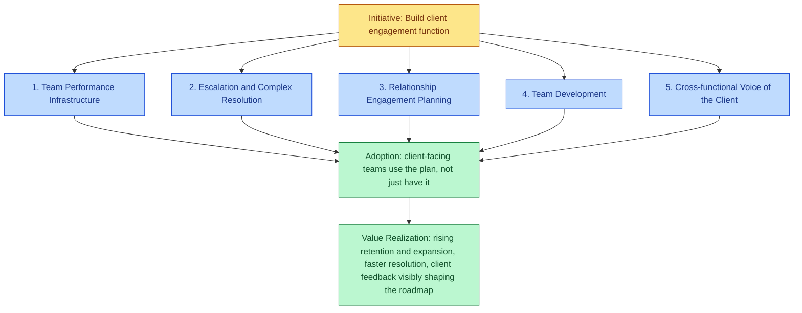

# client-engagement-leadership-model

 

A worked example: leading the client engagement function for a philanthropic capital platform — team performance infrastructure, escalation ownership, relationship engagement planning, and cross-functional voice-of-the-client partnership — without treating "clients are onboarded" and "clients are getting value" as the same milestone.

Status: early / worked example. This models one hypothetical mandate end to end rather than defining a general framework. See business-enablement-concept-model (https://github.com/AC-tech-alt/business-enablement-concept-model) for the underlying concept model this is built on.

## The scenario

A philanthropic capital platform manages a growing base of sophisticated clients — donor-advised fund holders, private foundations, and fiscally sponsored projects — who expect their capital to be deployed toward mission-aligned outcomes quickly, transparently, and with excellent service. The client engagement function needs team performance infrastructure, a clear escalation path for complex relationships, systematic engagement planning, and a real channel for client feedback to reach product and strategy, all while the client base is already growing.

## Business Problem to Initiative

Business Problem: The client base has grown past what ad hoc relationship management can support — escalations get handled inconsistently, there's no shared KPI framework for measuring client experience, and client feedback isn't systematically reaching the teams that could act on it.

Initiative: Build and lead the client engagement function — the team, systems, and operating rhythms that turn client feedback into action and scale relationship excellence as the client base grows.

## The five Workflows

This mandate isn't one job — it's five distinct Workflows sitting under one Initiative, each with its own execution plan and its own definition of adoption. Treating this as a single "client engagement is up and running" status is exactly the failure mode this model exists to catch.

### 1. Team Performance Infrastructure

Execution Plan: Stand up a KPI framework — response time, onboarding cycle time, satisfaction, retention and expansion — tied to the CRM and a regular business-review rhythm, so performance gaps surface as a trend, not a client complaint.

Field Readiness looks like: Leadership can open one dashboard and see team performance against every KPI without waiting on a manual roll-up.

Evidence this isn't theoretical: Architected the centralized grants and data infrastructure behind a $500M+ portfolio serving hundreds of donor-advised funds, 90+ public foundation vehicles, and active fiscally sponsored projects, and served as Product Owner for a digital transformation that built AI tools directly into Salesforce and reporting systems. A comparable infrastructure rebuild measurably increased cross-functional processing speed by 25% and executive decision-making capacity by 30%.

*Illustrative mockup only — layout and metric categories, not real figures.*

### 2. Escalation and Complex Resolution

Execution Plan: Define a clear escalation path for client situations that require judgment beyond standard process, with explicit criteria for when senior leadership needs to be looped in.

Field Readiness looks like: A complex client issue reaches the right decision-maker on the first escalation, not after two or three handoffs.

Evidence: Managed expenditure-responsibility and anti-bribery/anti-corruption frameworks with 100% compliance across a $500M+ portfolio, and administered compliance protocols spanning multiple regulatory regimes at once — the same judgment-under-ambiguity that complex-client escalation ownership requires.

### 3. Relationship Engagement Planning

Execution Plan: Build annual engagement plans for top-tier relationships with clear goals, and a structured, cross-functionally coordinated onboarding path for complex or strategic clients.

Field Readiness looks like: A strategic client's first 90 days feel coordinated and intentional, not improvised by whichever team happens to pick up the account.

Evidence: Managed $50M+ in corporate social impact programs across a portfolio of 10+ Fortune 500 clients end to end, including a $5M rapid-response partnership that moved from structuring through closeout on a compressed timeline without cutting corners on compliance. Ran full P&L and end-to-end client experience for 750+ individual clients as a founder, from acquisition through delivery.

### 4. Team Development

Execution Plan: Hire, coach, and build career pathing for client-facing team members as the team scales, with clear standards for communication excellence.

Field Readiness looks like: Team members know what growth looks like and get real-time coaching, not just an annual review.

Evidence: Currently recruits, coaches, and develops a cross-functional team of 12 to 15 directing operational execution and fiscal governance for a $500M+ portfolio, building management capability while shipping six major process enhancements that increased delivery scalability without a proportional increase in headcount.

### 5. Cross-functional Voice of the Client

Execution Plan: Represent client feedback patterns in strategy conversations, and partner with business development, legal, investments, and operations on shared client-facing initiatives.

Field Readiness looks like: Product and service decisions reflect real client feedback patterns, not internal assumptions about what clients want.

Evidence: Served as Product Owner for a digital grants system transformation, translating direct feedback from donors and grantee partners into product requirements built into Salesforce and reporting systems — the same client-input-to-product loop this workflow depends on. Recognized for executive communication and stakeholder alignment across matrixed organizations.

## Where I'd start (first 90 days)

Stand up the KPI framework and CRM reporting first, since every other workflow needs a shared way to measure what "working" means. Define the escalation path and criteria next, so complex issues have a clear home before the next one arrives. Then pilot the annual engagement-plan process with the handful of most strategic relationships before generalizing it across the full client base. Adoption gets checked by whether client-facing teams actually use the plan, not by whether it got written.

## Why this approach

Most client engagement functions get scored on whether the team is staffed and the CRM is live, not on whether clients actually feel the difference six months later. This example follows the same design philosophy as [Evani Govender's CommonGood Atlas](https://www.linkedin.com/pulse/grant-payment-why-grantmaking-systems-need-shared-evani-govender-rn5bc/): name the concepts precisely enough that leadership, client-facing teams, and cross-functional partners are all working from the same definition of "done" — then build the systems on top of that shared language, not the other way around.

## Core concepts at a glance

| Concept | One-line definition | In this example |
|---|---|---|
| Business Problem | A validated gap between current and desired state, named by a domain leader | Ad hoc relationship management can't keep up with a growing, sophisticated client base |
| Initiative | The chartered effort to close a Business Problem | Build and lead the client engagement function |
| Workflow | The designed sequence of steps, roles, and systems that operationalizes part of an Initiative | Each of the five Workflows above: Team Performance Infrastructure, Escalation and Complex Resolution, Relationship Engagement Planning, Team Development, Cross-functional Voice of the Client |
| Execution Plan | The concrete build-out of a Workflow | The build steps under each Workflow's "Execution Plan" line |
| Field Readiness | The state where people have what they need to run the Workflow | What "Field Readiness looks like" describes under each Workflow |
| Adoption | Sustained, observed use of the Workflow under normal operating pressure | Client-facing teams use the engagement plan and escalation path, not just have access to them |
| Value Realization | The measured outcome the Initiative was chartered to produce | Rising retention and expansion, faster resolution times, client feedback visibly shaping the roadmap |

Full definitions live in [business-enablement-concept-model](https://github.com/AC-tech-alt/business-enablement-concept-model/tree/main/concepts); this table shows how each concept maps onto this specific scenario.

## Next steps

- [ ] Validate the escalation criteria against a real multi-stakeholder, high-ambiguity client scenario
- [ ] Build out the annual engagement-plan template beyond the top tier of relationships
- [ ] Define specific KPI targets (response time, onboarding cycle time, NPS) rather than just naming the categories
- [ ] Pressure-test the model against a client base with a much wider sophistication range, from first-time to highly experienced investors
- [ ] Add a worked example of a cross-functional handoff from prospect through steady-state servicing

## License

MIT — see [LICENSE](./LICENSE).
