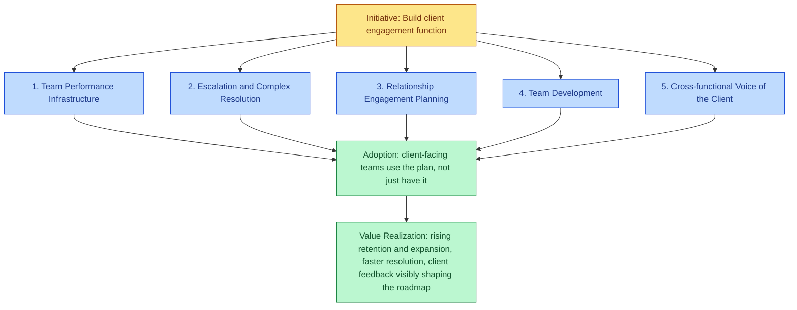
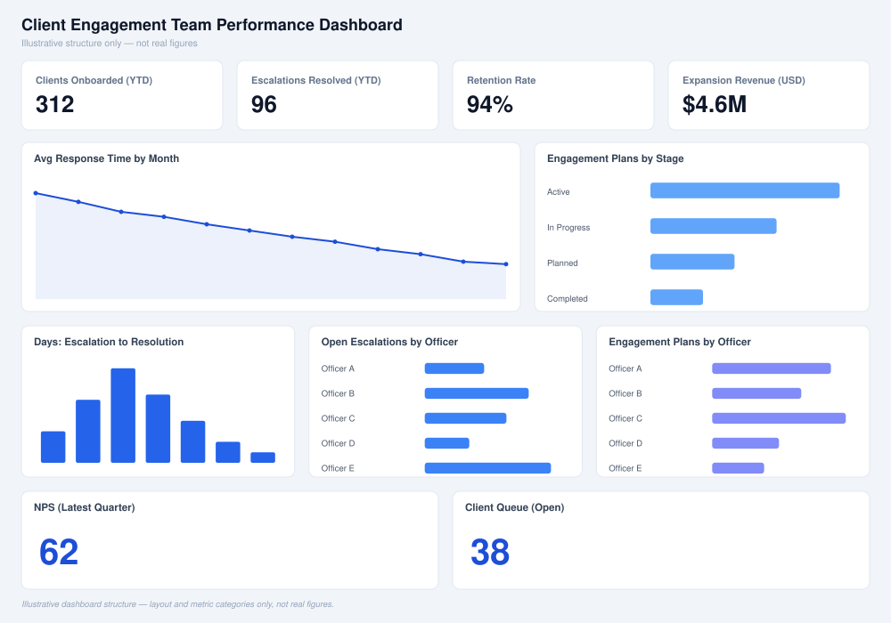

# client-engagement-leadership-model

 

A worked example: leading the client engagement function for a philanthropic capital platform — team performance infrastructure, escalation ownership, relationship engagement planning, and cross-functional voice-of-the-client partnership — without treating "clients are onboarded" and "clients are getting value" as the same milestone.

Status: early / worked example. This models one hypothetical mandate end to end rather than defining a general framework. See [business-enablement-concept-model](https://github.com/AC-tech-alt/business-enablement-concept-model) for the underlying concept model this is built on.

## The scenario

A philanthropic capital platform serves a deliberately wide client spectrum: individuals opening their first donor-advised fund, single-family offices building a decades-long impact strategy, multi-family offices coordinating impact investing across many client relationships at once, foundations professionalizing an existing portfolio, and corporations running employee-directed giving through the same infrastructure. Products span a turnkey donor-advised fund, an impact investment platform for private funds and companies, client-recommended direct investments, custom portfolios for larger accounts, due diligence services, and full back-office administration for foundation-compatible structures.

The client engagement function needs team performance infrastructure, a clear escalation path for complex relationships, systematic engagement planning, and a real channel for client feedback to reach product and strategy — across a client base where a first-time individual donor and a multi-family office running eight-figure custom portfolios sit on the same team's book.

## Business Problem to Initiative

Business Problem: The client base spans five distinct segments — individuals, single-family offices, multi-family offices, foundations, and corporations — each with a different product mix and complexity level, and ad hoc relationship management can't flex across that range. Escalations get handled inconsistently, there's no shared KPI framework for measuring client experience across segments, and client feedback isn't systematically reaching the teams that could act on it.

Initiative: Build and lead the client engagement function — the team, systems, and operating rhythms that turn client feedback into action and scale relationship excellence across every client segment as the base grows.

## The five Workflows

This mandate isn't one job — it's five distinct Workflows sitting under one Initiative, each with its own execution plan and its own definition of adoption. Treating this as a single "client engagement is up and running" status is exactly the failure mode this model exists to catch.

### 1. Team Performance Infrastructure

Execution Plan: Stand up a KPI framework — response time, onboarding cycle time, satisfaction, retention and expansion — tied to the CRM and a regular business-review rhythm, segmented by client type so a multi-family office and an individual donor aren't measured against the same benchmark.

Field Readiness looks like: Leadership can open one dashboard and see team performance against every KPI, by segment, without waiting on a manual roll-up.

Evidence this isn't theoretical: Architected the centralized grants and data infrastructure behind a $500M+ portfolio serving hundreds of donor-advised funds, 90+ public foundation vehicles, and active fiscally sponsored projects, and served as Product Owner for a digital transformation that built AI tools directly into Salesforce and reporting systems. A comparable infrastructure rebuild measurably increased cross-functional processing speed by 25% and executive decision-making capacity by 30%.

*Illustrative dashboard structure only — layout and metric categories, not real figures.*

### 2. Escalation and Complex Resolution

Execution Plan: Build a tiered escalation path with clear ownership at each tier, so a custom-portfolio dispute, a due-diligence disagreement, and a back-office administration failure each land with someone who has the authority and context to resolve it, not just the availability.

Field Readiness looks like: Every open escalation has a named owner, a resolution target, and a status a manager can see without asking.

Evidence this isn't theoretical: Served as the escalation point for judgment-heavy compliance and relationship situations — expenditure-responsibility and anti-bribery/anti-corruption frameworks — with 100% compliance across a $500M+ portfolio, and led a $5M rapid-response partnership from structuring through closeout on a compressed timeline without cutting compliance corners.

### 3. Relationship Engagement Planning

Execution Plan: Build a standing engagement-planning cadence for top-tier relationships — single- and multi-family offices, foundations, and corporate accounts moving into custom portfolios — so growth conversations happen on a schedule, not only when a client raises one.

Field Readiness looks like: Every top-tier relationship has a written engagement plan with next steps and an owner, reviewed on a set cadence rather than reconstructed from memory before each call.

Evidence this isn't theoretical: Managed $50M+ in corporate social impact programs across 10+ Fortune 500 relationships end to end at GlobalGiving, and as founder of two client-facing brands owned full P&L and end-to-end client experience for 750+ individual clients, from acquisition through delivery.

### 4. Team Development

Execution Plan: Recruit, coach, and develop a client-facing team against the KPI framework from Workflow 1, with OKRs and a hiring plan that scales with the client base instead of lagging it.

Field Readiness looks like: Every team member has current OKRs tied to the shared KPI framework, and a documented development plan, not just a job description.

Evidence this isn't theoretical: Currently recruit, coach, and develop a cross-functional team of 12–15, shipping six major process enhancements that increased delivery scalability without a proportional increase in headcount.

### 5. Cross-functional Voice of the Client

Execution Plan: Build a real channel for client feedback to reach product and strategy — including the due diligence and back-office administration teams that sit outside client engagement — so client input shapes decisions instead of stopping at the account team.

Field Readiness looks like: Product and strategy teams can point to a specific decision that changed because of client feedback routed through this channel, not just a shared inbox no one reads.

Evidence this isn't theoretical: As Product Owner for a digital grants system transformation, translated direct feedback from donors and grantee partners into product requirements built into Salesforce and reporting systems — the same client-input-to-product loop this workflow depends on — and was recognized for executive communication and stakeholder alignment across matrixed, cross-functional organizations.

## Where I'd start

Team Performance Infrastructure first. Escalation ownership and engagement planning both depend on a shared, segmented KPI framework already being in place — without it, the other four workflows are running on instinct instead of evidence.

## Why this approach

The same failure mode shows up in grant operations and client engagement: a function gets treated as "done" once it exists, instead of tracked through to whether it's actually changing outcomes. Five workflows with their own execution plans and field-readiness criteria force that distinction — a KPI dashboard that nobody reviews isn't team performance infrastructure, and an escalation process nobody uses isn't complex resolution. This model is built to catch that gap before it becomes a client's problem.

## License

MIT — see [LICENSE](./LICENSE).

## Pressure test

See [examples/pressure-test.md](./examples/pressure-test.md) for a cross-segment escalation scenario that stress-tests three workflows at once, with an honest accounting of where the model bends.

## Communication standards

A workflow description says the team is responsive and escalations get resolved. It doesn't say how fast, what happens when a client goes quiet, or who covers an account when an officer is out. See examples/communication-standards.md (./examples/communication-standards.md) for what that looks like as an actual operating document — tiered response commitments, an escalation ladder, and a rule for what to say when a timeline becomes genuinely unpredictable.

## Core concepts at a glance

| Concept | What it means here |
|---|---|
| Business Problem | The client base spans five segments with different needs; ad hoc relationship management can't flex across that range. |
| Initiative | Build and lead the client engagement function end to end. |
| Workflow | One of five distinct pieces of the mandate, each with its own execution plan. |
| Execution Plan | The concrete steps that stand up a Workflow. |
| Field Readiness | The observable signal that a Workflow is actually in use, not just built. |
| Adoption | Client-facing teams use the plan, not just have it. |
| Value Realization | Rising retention and expansion, faster resolution, client feedback visibly shaping the roadmap. |

## Next steps

- [ ] Pilot the KPI framework with one segment before rolling it out across all five
- [ ] Define escalation tiers and named owners before the first complex case arrives
- [ ] Set the engagement-plan review cadence and put it on the calendar, not just in a doc
- [ ] Identify the first cross-functional partner for the voice-of-the-client channel
